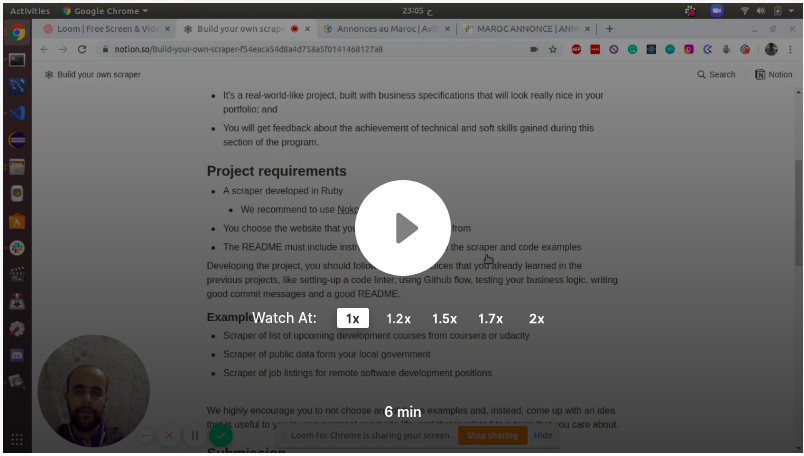
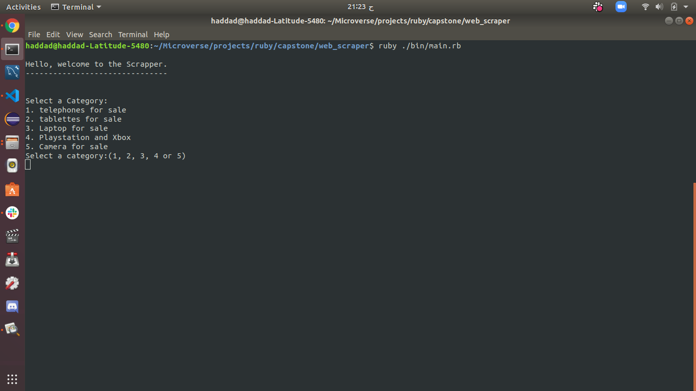
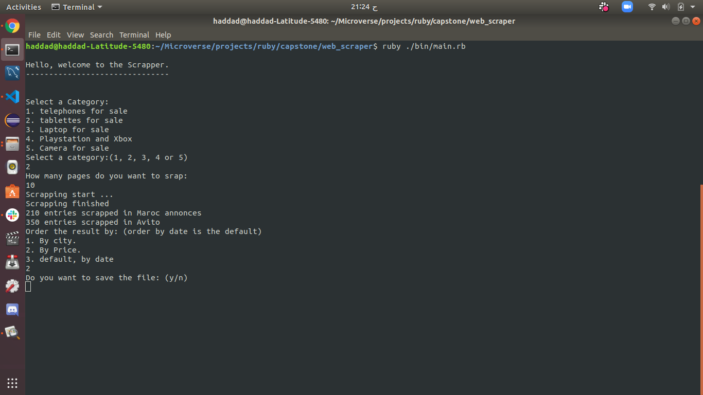
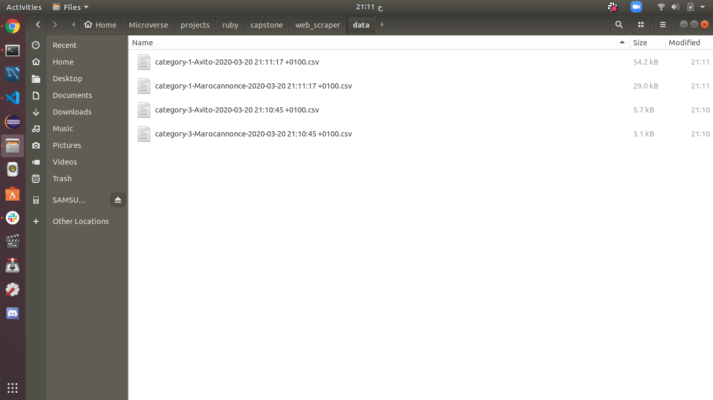
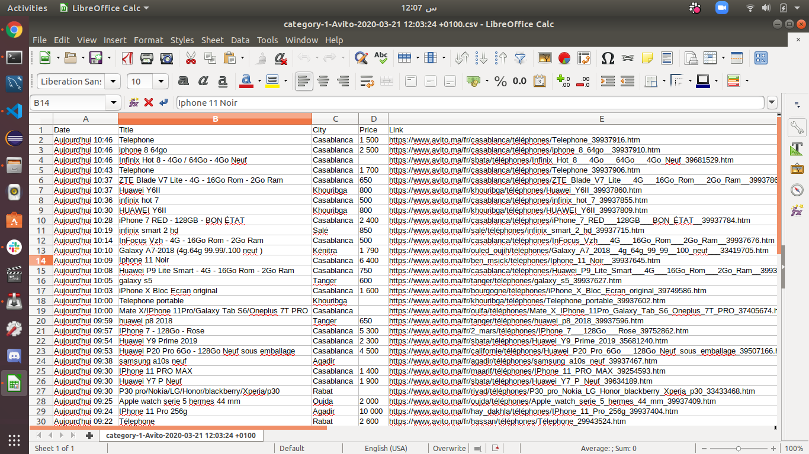

# web_scraper

This project is a Web scrapper in Ruby. This tool allows you to scrap some Moroccan online selling websites (Avito and Marocannonce) at the same time to collect data for the same category in all website. You will find more information about the project in the video below.

## Built With

- Ruby
- Nokogiri gem
- Httparty gem

## Video presentation

[](https://www.loom.com/share/b09efea91d744c81a338b7cb29f770d2)
## How to use:

First ruby should be install in your local enviroment:
#### Enviroment set up requirements:
Run the following commend:

```
$ ruby -v
```

You should a have a result similar to this:

```
ruby 2.6.5p114 (2019-10-01 revision 67812) [x86_64-linux]
```

If you don't get that result, follow this [link](https://www.ruby-lang.org/en/documentation/installation/) and install Ruby in your local enviroment.

#### Use the tool:
Start by Cloning this repository and cd inside the folder.
Run the following command:
- Run `gem install bundler` to install bundler.
- Run `bundle install` to install Nokogiri and HTTParty Gems.
- Run `ruby ./bin/main.rb`.
Then follow the instructions provided in the console.

You start by choosing which category to scrap.

Then you specify the number of pages you want to scrap in each source (Avito and Marocannonce), you can also sort the result either by price, city or keep the default (by date) and finaly save your result in a file.
If you choose to save the file, go to data folder:

The name start with the category that you choose to scrap, then the source of data and finaly a date tag.

If you open one of those files, you will find data formatted in the following way.
#### Run tests
To run tests:
- Run `gem install bundler` to install bundler.
- Run `bundle install` to install RSpec, Nokogiri and HTTParty Gems.
- Run `rspec` in Command Line.

## Authors

👤 **HADDAD SOHAIB**

- Github: [@HADDADSOHAIB](https://github.com/HADDADSOHAIB)
- Twitter: [@HaddadSohaib](https://twitter.com/HaddadSohaib)
- Linkedin: [linkedin](https://www.linkedin.com/in/sohaibhaddad/)
 
## 🤝 Contributing

Contributions, issues and feature requests are welcome!

Feel free to check the [issues page](issues/).

## Show your support

Give a ⭐️ if you like this project!

## Acknowledgments

- [Microverse](https://www.microverse.org/).

## 📝 License

This project is [MIT](https://haddad-sohaib.mit-license.org/) licensed.
